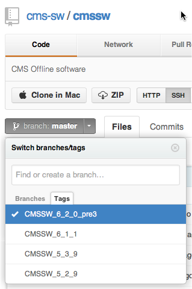
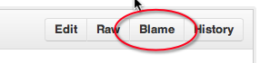

# Advanced usage

* auto-gen TOC:
{:toc}

### How do I checkout the full CMSSW repository locally?

To checkout the full CMSSW repository locally you can do:

    git clone cmssw-main src

in your SCRAM work area.  Notice this will require a github account (see
[here]() for the relevant FAQ). Alternatively you can do:
    
    git clone cmssw-main-ro src

for read only access. If you want to checkout a given tag, you need to 
specify it via the `-b` flag, e.g.:

    git clone cmssw-main src -b CMSSW_6_1_0

See [here][git-clone-repo] for more detailed information on `git clone`
command.

[git-clone-repo]: http://git-scm.com/book/en/Git-Basics-Getting-a-Git-Repository#Cloning-an-Existing-Repository

### How do I browse / search the code?

The source code for the official CMSSW repository can be found in the main
github page for CMSSW: <https://github.com/cms-sw/cmssw>.

Branches and tags are available by clicking on the "branches" combo box in the
top left part of the page:

The source-code of the official CMSSW can be searched by using
https://github.com/cms-sw/cmssw/search .

If you prefer using the command line interface, you can do the same by using
`git grep` command inside `CMSSW/src` area:

    git grep <reg-expr>

e.g.:

    git grep Plugin.*

which will give you:

    Alignment/CSA06AlignmentAlgorithm/BuildFile:<use name=FWCore/PluginManager>
    Alignment/CommonAlignmentAlgorithm/BuildFile.xml:<use   name="FWCore/PluginManager"/>
    Alignment/CommonAlignmentAlgorithm/interface/AlignmentAlgorithmPluginFactory.h:#include "FWCore/PluginManager/interface/PluginFactory.h"
    Alignment/CommonAlignmentAlgorithm/interface/IntegratedCalibrationPluginFactory.h:#include "FWCore/PluginManager/interface/PluginFactory.h"
    Alignment/CommonAlignmentMonitor/BuildFile.xml:<use   name="FWCore/PluginManager"/>
    Alignment/CommonAlignmentMonitor/interface/AlignmentMonitorPluginFactory.h:#include "FWCore/PluginManager/interface/PluginFactory.h"
    Alignment/CommonAlignmentMonitor/plugins/AlignmentMonitorTemplate.cc:// #include "PluginManager/ModuleDef.h"
    Alignment/CommonAlignmentMonitor/plugins/AlignmentStats.cc:#include "FWCore/PluginManager/interface/ModuleDef.h"
    Alignment/CommonAlignmentMonitor/plugins/BuildFile.xml:<use   name="FWCore/PluginManager"/>
    ...

for more information about `git grep` click [here](http://git-scm.com/docs/git-grep).

### How do I tell who is responsible for a given change?

Let's say you want to find out who is responsible for a given
change in `FWCore/Framework/BuildFile.xml`. If you are happy with using
the web based GUI you can simply browse to the given file ([click
here](https://github.com/cms-sw/cmssw/blob/master/FWCore/Framework/BuildFile.xml)
for this particular example). 

Then click on the "Blame" button (again [click
here](https://github.com/cms-sw/cmssw/blame/master/FWCore/Framework/BuildFile.xml)
for the particular example). 

You can get the full information about a given change
(including which files changed in the same commit) by clicking on the 
specific commit-id (the hash in the left column, [for example
bd2fd326](https://github.com/cms-sw/cmssw/commit/bd2fd32657121cda0cc132a98b3b0d68773788b8)).

Alternatively if you prefer doing it from the command line, you can use the
`git blame` command to find out for each line which `commit-id` is responsible
for a given change.

    > git blame FWCore/Framework/BuildFile.xml

which returns:

    f4330d28 (wmtan 2010-02-18 23:10:32 +0000  1) <use   name="DataFormats/Common"/>
    f4330d28 (wmtan 2010-02-18 23:10:32 +0000  2) <use   name="DataFormats/Provenance"/>
    f4330d28 (wmtan 2010-02-18 23:10:32 +0000  3) <use   name="FWCore/Common"/>
    f4330d28 (wmtan 2010-02-18 23:10:32 +0000  4) <use   name="FWCore/MessageLogger"/>
    f4330d28 (wmtan 2010-02-18 23:10:32 +0000  5) <use   name="FWCore/ParameterSet"/>
    f4330d28 (wmtan 2010-02-18 23:10:32 +0000  6) <use   name="FWCore/PluginManager"/>
    f4330d28 (wmtan 2010-02-18 23:10:32 +0000  7) <use   name="FWCore/PythonParameterSet"/>
    f4330d28 (wmtan 2010-02-18 23:10:32 +0000  8) <use   name="FWCore/ServiceRegistry"/>
    f4330d28 (wmtan 2010-02-18 23:10:32 +0000  9) <use   name="FWCore/Utilities"/>
    f4330d28 (wmtan 2010-02-18 23:10:32 +0000 10) <use   name="FWCore/Version"/>
    f4330d28 (wmtan 2010-02-18 23:10:32 +0000 11) <use   name="boost"/>
    bd2fd326 (wmtan 2013-01-30 23:21:16 +0000 12) <use   name="rootcintex"/>
    f4330d28 (wmtan 2010-02-18 23:10:32 +0000 13) <use   name="rootcore"/>
    f4330d28 (wmtan 2010-02-18 23:10:32 +0000 14) <export>
    f4330d28 (wmtan 2010-02-18 23:10:32 +0000 15)   <lib   name="1"/>
    f4330d28 (wmtan 2010-02-18 23:10:32 +0000 16) </export>

Let's say we are interested in line 12, i.e. `<use   name="rootcintex"/>`. 
The first column gives us the `commit-id` (`bd2fd326` in this case). To find out everything
about that commit you can use the `git show` command:

    git show bd2fd326

which returns:

    commit bd2fd32657121cda0cc132a98b3b0d68773788b8
    Author: wmtan <>
    Date:   Wed Jan 30 23:21:16 2013 +0000
    
        With Reflex usage partially removed, EventProcessor needs CINT dictionaries
    
    diff --git a/FWCore/Framework/BuildFile.xml b/FWCore/Framework/BuildFile.xml
    index a5cae15..52e584d 100644
    --- a/FWCore/Framework/BuildFile.xml
    +++ b/FWCore/Framework/BuildFile.xml
    @@ -9,6 +9,7 @@
    <use   name="FWCore/Utilities"/>
    <use   name="FWCore/Version"/>
    <use   name="boost"/>
    +<use   name="rootcintex"/>
    <use   name="rootcore"/>
    <export>
    <lib   name="1"/>
    diff --git a/FWCore/Framework/src/EventProcessor.cc b/FWCore/Framework/src/EventProcessor.cc
    index a8fe6c3..fbe4bc3 100644
    --- a/FWCore/Framework/src/EventProcessor.cc
    +++ b/FWCore/Framework/src/EventProcessor.cc
    @@ -83,6 +83,9 @@
    #include <sched.h>
    #endif
    
    +//Needed for introspection
    +#include "Cintex/Cintex.h"
    +
    namespace edm {
    
    namespace event_processor {
    @@ -585,6 +588,8 @@ namespace edm {
                            serviceregistry::ServiceLegacy iLegacy) {
    
        //std::cerr << processDesc->dump() << std::endl;
    +
    +    ROOT::Cintex::Cintex::Enable();
    
        boost::shared_ptr<ParameterSet> parameterSet = processDesc->getProcessPSet();
        //std::cerr << parameterSet->dump() << std::endl;

### How can I find out who is developing in a given package?

If you are interested in the general developers for a given package, the best
option is probably to use `git log -- <subsytem>/<package>` in the toplevel
directory and have a look at recent developments. A slightly fancier way of
doing it is via:

    git log --pretty="%an" --since 1y -- <subsytem>/<package> | sort -u

which will print only the authors ( `--pretty="%an"` ) who have committed something in 
the given `<subsytem>/<package>` in the last year ( `--since 1y` ).

### Downloading from github is painfully slow, how can I improve the situation?

If you have a local mirror of CMSSW repository at your site / university you
can use it by setting the `CMSSW_MIRROR` environment variable. E.g.:

    export CMSSW_MIRROR=https://:@git.cern.ch/kerberos/CMSSW.git
    # setenv CMSSW_MIRROR https://:@git.cern.ch/kerberos/CMSSW.git

for CERN.

`git cms-addpkg` will then use it to fetch most of the data, and then switch to the
official repository for fetching the missing parts.

If you happen to have a local copy of the reposiry on the machine you are working
on you can speed up things even further by having:

    export CMSSW_GIT_REFERENCE=<repository-path>

in particular people working on lxplus can use:

    export CMSSW_GIT_REFERENCE=/afs/cern.ch/cms/git-cmssw-mirror/cmssw.git

or in case you have CVMFS available you can set it too:

    export CMSSW_GIT_REFERENCE=/cvmfs/cms.cern.ch/cmssw.git

### How do I setup a local mirror?

Git allows you to mirror a repository by doing:

    CMSSW_MIRROR_PATH=<some-path>
    git clone --mirror --bare https://github.com/cms-sw/cmssw.git $CMSSW_MIRROR_PATH

Done that you can update the mirror via:
    
    cd $CMSSW_MIRROR_PATH
    git remote update

### How do I collapse multiple commits into one?

A very common pattern when developing a feature with git is to commit very
often, to keep track of even small set of changes and once one is happy with
the feature branch to go back, collapse all the minor changes and write a nice
commit message.

Let's assume for example you have a very long commit history for a topic branch
`my-topic`.

    * 00b32e7 - Sat, 6 Apr 2013 11:07:19 +0200 (10 minutes ago) (HEAD, my-topic)
    |           A typo.  Giulio Eulisse
    * 6ed6e45 - Sat, 6 Apr 2013 11:06:49 +0200 (11 minutes ago)
    |           Some documentation added.  Giulio Eulisse
    * 74f8fd0 - Sat, 6 Apr 2013 11:06:34 +0200 (11 minutes ago)
    |           Some more bug fixes.  Giulio Eulisse
    * 39165d9 - Sat, 6 Apr 2013 11:06:00 +0200 (12 minutes ago)
    |           Some bugfix.  Giulio Eulisse
    * 3a775f1 - Sat, 6 Apr 2013 11:05:21 +0200 (12 minutes ago)
                Initial commit for topic.  Giulio Eulisse

once you are completely happy with your topic branch, you might not
particularly care about all the intermediate steps, and you might want to
squash all of them into one. This is done by using the `git reset` command: it
will rever you back to a given commit, but it will keep your changes in the
working tree, ready to be committed. E.g.:

    git reset --soft 3a775f1

will reset the commit index to the "Initial commit for topic." but it will
leave all code changes ready to be committed. You can then amend the initial commit
with all the changes you previously did by simply doing:

    git commit --amend

which will prompt for an updated message and will results in one single commit:

    * f7400d3 - Sat, 6 Apr 2013 11:05:21 +0200 (19 minutes ago) (HEAD, master)
                Some Feature added and tested.  Giulio Eulisse

For more information about how to rewrite history, you can have a look at the
[git guide](http://git-scm.com/book/en/Git-Tools-Rewriting-History). In
particular once you are familiar with the concept you might want to look at
[`git rebase
--interactive`](http://git-scm.com/book/en/Git-Tools-Rewriting-History#Changing-Multiple-Commit-Messages) which provides
more flexibility when you want to do more that simply merge a set of commits
into one.

### How do I pick up a commit from a branch and apply it to another branch?

Have a look at the `git-cherry-pick` command. E.g.:

    git cherry-pick <hash-of-commit-on-another-branch>

will take `<hash-of-commit-on-another-branch>` and apply it on the current
branch. Notice that the new commit will have a different hash, because the
history is different.

### I need to checkout a file from the old CVS HEAD / a release tag, how can I do it?

The _CVS HEAD_ at the time of the migration is available in the git branch
`imported-CVS-HEAD`. You can checkout files from the by simply fetching that
branch in your local workarea and then using git checkout for it.

For example lets assume you want to checkout the _HEAD_ of 
`PhysicsTools/Configuration/test/SUSY_pattuple_cfg.py` in CMSSW_5_3_11, where
it was never released. First you need to set up the area and fetch the branch:

    scram project CMSSW_5_3_11
    cd CMSSW_5_3_11/src
    cmsenv

this needs to be done only once per workarea. Then you do:

    git cms-addpkg PhysicsTools/Configuration
    git fetch official-cmssw imported-CVS-HEAD:imported-CVS-HEAD
    git checkout imported-CVS-HEAD -- PhysicsTools/Configuration/test/SUSY_pattuple_cfg.py

Notice the `git cms-addpkg` is needed to bring in the package (i.e. make the
sparse checkout). Finally notice you can use the same recipe to checkout files
in different release tags (e.g. CMSSW_5_3_11).

### I made a mess and I do not know what I've currently checked out!

It can happen that due to wrong manipulations of the history, merging or
rebasing, one finds itself with the current branch ref pointing to something
unexpected. In order to view the history of the actions done, one can use the

    git reflog

command which will print out the various steps of the HEAD. E.g:

    7225357 HEAD@{0}: commit: Align header.
    a59e3bd HEAD@{1}: rebase -i (finish): returning to refs/heads/gh-pages
    a59e3bd HEAD@{2}: rebase -i (pick): Typos.
    fbb9019 HEAD@{3}: rebase -i (pick): Nicer tables.
    83a21a1 HEAD@{4}: rebase -i (pick): Migration postponed.
    5acef5f HEAD@{5}: rebase -i (squash): Move Rosetta stone in a glorified page.
    9911088 HEAD@{6}: rebase -i (squash): updating HEAD
    d3f80cb HEAD@{7}: checkout: moving from gh-pages to d3f80cb
    f48873e HEAD@{8}: commit: Move rosetta.
    ff1e4b0 HEAD@{9}: rebase -i (finish): returning to refs/heads/gh-pages

One can then use `git reset --hard <some-hash>` to revert back to some point in
history.

To learn more about git reflog you can look at [its man
page](https://www.kernel.org/pub/software/scm/git/docs/git-reflog.html) or the
[Pro Git](http://git-scm.com/book/ch6-1.html#RefLog-Shortnames) section about
it.

### How do I ask a question?

If you have more questions about git and CMSSW on git, please use [this
form][new-faq-form].

[new-faq-form]: https://github.com/cms-sw/cmssw/issues/new
