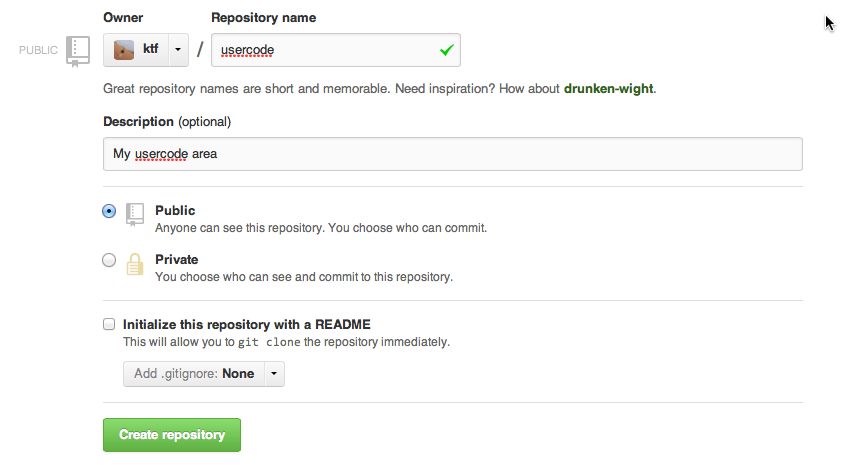

# CMS UserCode Migration FAQs

* auto-gen TOC:
{:toc}

### What is happening?

Just like CMSSW, UserCode repositories will have to migrate away from
`CVS`. The deadline for the migration is the 31st of July, i.e. after the
Lepton-Photon and EPS. See also [the presentation in the spring CMS
Week][cms-week-presentation].

UserCode areas will **not** be centrally migrated, however we provide scripts
and assistance to migrate them to github, reccomended, or the git / svn service
of your preference.

### Can I stick with CVS?

Unfortunately no. CERN/IT wants to shut down the CVS service since years and
while we have been able to postpone it so far to avoid disruption of Higgs
discovery, the long shutdown removes that excuse. This is however a perfect
time to improve how way of working and get rid of all the complications that
came from using an obsolete VCS like CVS.

### Can't we postpone it further?

No.

### Really?

Yes.

### Ok...

Thanks for understanding. We will try to help as much as we possibly can during
your transition.

### Where should I host my repository?

You are free of hosting your repository on any git / SVN hosting site you
prefer, however given we will use http://github.com for the CMSSW code, it's
probably a good idea if you stick with it too.

### How do I migrate to github?

**First of all follow the account creation instructions
  [here](http://cms-sw.github.io/cmssw/faq.html#how_do_i_subscribe_to_github)**.
Once you have done that create a new repository to hold your usercode.
This can be done by simply going to [https://github.com/new](https://github.com/new).

Click on "Create Repository" and note down the URL of your newly created
repository.

Now you want to migrate your old `UserCode` area to git. This can be done from
inside a CMSSW release (`CMSSW_5_3_11` or `CMSSW_6_2_0_pre7` and subsequent
ones) on `lxplus5` (`lxplus6` also should work) by doing:

    MYUSERCODE=Eulisse
    cvs2git --blobfile=git-blob.dat --dumpfile=git-dump.dat \
            /afs/cern.ch/project/cvs/reps/CMSSW/UserCode/$MYUSERCODE \
            --symbol-transform="(.*)/:\1-" \
            --use-external-blob-generator \
            --fallback-encoding "UTF8" \
            --username $USER 

This step could take a few seconds or hours, depending on how much stuff you
have in your user area. If you have large datafiles we reccomend split the
repository into two parts, one for the datafiles, one for the actual code.

You can now import your old CVS repository into a new git one you created
on git hub:

    MY_GITHUB_USER=`git config --get user.github`
    MY_REMOTE=git@github.com:$MY_GITHUB_USER/usercode.git
    # set MY_GITHUB_USER `git config --get user.github` # csh
    # setenv MY_REMOTE git@github.com:`git config --get user.github`/usercode.git # csh
    git init usercode
    cd usercode
    git remote add origin $MY_REMOTE
    cat ../git-blob.dat ../git-dump.dat | git fast-import
    git config http.postBuffer 524288000
    git push --mirror -u origin

In case you have some error, try `git push origin master` before the last line.

In case you get the following message:

    Permission denied (publickey).
    fatal: The remote end hung up unexpectedly

you forgot to register your ssh key when you registered to github, you can do
it by going to https://github.com/settings/ssh and adding your public key
there.

Further information about cvs2git can be found at http://cvs2svn.tigris.org/cvs2git.html.

### I need a private repository!

First of all, keep in mind that your UserCode area was never private, so you
are asking for something new. If you really want to have a private repository you can 
use CERN/IT provided service at https://cernforge.cern.ch/cernforge/. 

The above mentioned recipe becomes:

    MY_REMOTE=https://:@git.cern.ch/kerberos/<repo_name>
    # setenv MY_REMOTE https://:@git.cern.ch/kerberos/<repo_name> # tcsh
    # or https://git.cern.ch/reps/<repo_name>
    git clone $MY_REMOTE
    cd your_repo_directory
    cat ../git-blob.dat ../git-dump.dat | git fast-import
    git config http.postBuffer 524288000
    git push --mirror -u origin

You can find more documentation, provided by CERN/IT,
[here](https://cern.service-now.com/service-portal/faq.do?se=git-service). In
case of troubles with CERN/IT provided repositories please use the [standard
Service NOW! portal](https://cern.service-now.com).

### Do you have any more in-depth FAQs?

Yes, please look at the [Standard git FAQ](faq.html) or at the [Advanced
Usage](advanced-usage) section.

### How do I prevent people from committing to the old CVS area?

Please [leave us a comment][new-faq-form] and we will make the CVS repository
read-only.

### I need to collaborate with some fellow physicists!

GitHub has to possible ways of dealing with this.

* The first and easier one, suitable for small (2-5) group of people is to add
  your collaborators as such to your repository. Please have a look at:
  https://help.github.com/articles/how-do-i-add-a-collaborator to see how to
  do it.

* The second, suitable for larger groups is to create an "Organization" and put
  the repository under it. This is what is done for example for Computing
  Projects, which all belong to the [dmwm](https://github.com/dmwm)
  organization. The main advantage of organizations is that they provide much
  more flexible organization of contributors in terms of "Teams" with different
  commit rights.  To learn more about organizations please have a look at
  https://github.com/blog/674-introducing-organizations . 
  
  If you would like to have support for an official CMS organization for some
  of the code you have in UserCode, (for example for a given POG / PAG), please
  [create an issue ticket](https://github.com/cms-sw/cmssw/issues/new) so that
  it can be discussed in a wider audience, if needed.

Moreover a very nice overview of collaborative workflows using GitHub and git
can be found [here](https://help.github.com/articles/using-pull-requests).

### Does this affect physics notes?

No. They are hosted in SVN and this will continue to be the case.

### I need to checkout subdirectories in a standalone manner.

At first loop approximation git checks out the full repository, there are
however a few workarounds to this which can help.

The first one is to really think if checking out part of the repository is
really something you need, and wether or not it wouldn't make sense to simply
checkout everything and live with it.

The main motivations for checking out a single subdirectory rather than many
are mainly space and compilation time.

* If you are compilation time bound, please make sure using `scram b -j 20`
  does not already solve your problem by compiling things in parallel.
* If you are space bound, e.g. you have one subdirectory containing lots of
  datafiles, you probably want to split that subdirectory into a separate
  repository, and have a look at how [git
  submodules](http://git-scm.com/book/en/Git-Tools-Submodules) work.

If you simply have too many files with different people working on it and you
are annoyed by the burden, you can have a look at [git sparse
checkout](http://www.kernel.org/pub/software/scm/git/docs/git-read-tree.html#_sparse_checkout),
which will hide unneeded bits, in particular you can look at what we plan to do
in in CMSSW, via [git-cms-addpkg](http://cms-sw.github.io/cmssw/git-cms-addpkg).

If you start from a single repository and later want to split off a sub path of
it in a separate repository, you can follow the instructions at:

https://help.github.com/articles/splitting-a-subpath-out-into-a-new-repository

### How do I checkout a file from the read-only CVS repository?

CVS access will be provided read-only for those people who might still need it
or who want to check historical information.

In order to use it you'll need to adapt your `CVSROOT` environment variable
via:

    export CVSROOT=:ext:<cern-user-account>@lxplus.cern.ch:/afs/cern.ch/user/c/cvscmssw/public/CMSSW
    # setenv CVSROOT :ext:<cern-user-account>@lxplus.cern.ch:/afs/cern.ch/user/c/cvscmssw/public/CMSSW

and then use the usual CVS commands. Of course you'll be not allowed to modify
the repository anymore.

### How do I ask a question?

If you have more questions about git and CMSSW on git, please use [this
form][new-faq-form].

[new-faq-form]: https://github.com/cms-sw/cmssw/issues/new
[cms-week-presentation]: https://indico.cern.ch/getFile.py/access?contribId=143&sessionId=10&resId=0&materialId=slides&confId=241277
